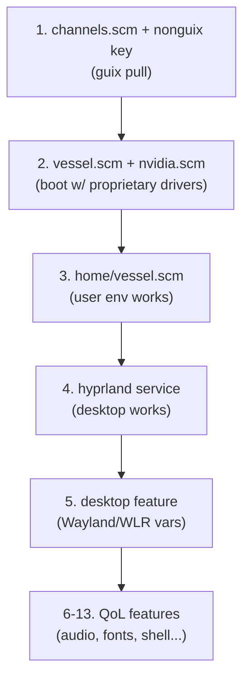

# Edict — Complete File Roadmap (NVIDIA + Hyprland Edition)

The repository scaffold is correct ([config.scm](file:///home/hirancph/Documents/guix-config/edict/modules/edict/config.scm), [utils.scm](file:///home/hirancph/Documents/guix-config/edict/modules/edict/utils.scm), [channels.scm](file:///home/hirancph/Documents/guix-config/edict/channels.scm), [Makefile](file:///home/hirancph/Documents/guix-config/edict/Makefile)), and all older hostname references have been renamed to `vessel`.

Since you have an **NVIDIA GPU** and want to use **Hyprland**, the structure changes significantly because NVIDIA requires the `nonguix` channel for proprietary drivers and the `linux-nonguix` kernel.

Here is the revised, priority-ranked roadmap of the files you need to build.

---

## The Makefile Explained

You mentioned you don't know how the [Makefile](file:///home/hirancph/Documents/guix-config/edict/Makefile) works. It's actually a massive time-saver. Guix commands can get very long.

When you run `make system`, the Makefile automatically runs:
`sudo -E guix system reconfigure -L modules/ modules/edict/systems/vessel.scm`

- `-L modules/` tells Guix to look in your `modules/` folder for custom code (like your features).
- `HOST ?= vessel` means it defaults to applying the `vessel.scm` file.

**Available Commands:**
- `make pull` — Updates Guix and the custom channels (like nonguix).
- `make system` — Reconfigures the system OS configuration (requires sudo).
- `make home` — Reconfigures the user dotfiles/apps (no sudo).
- `make gc` — Cleans up old generations to save disk space.

---

## Tier 1 — Critical (System Boot)

These are the absolute minimum to run `make system` and get a bootable machine.

| # | File | Purpose |
|---|------|---------|
| 1 | `modules/edict/systems/vessel.scm` | **The** `operating-system` definition — kernel, bootloader, file systems, hostname, user accounts. Everything starts here. |

---

## Tier 2 — The NVIDIA & Wayland Layer

Because you have an NVIDIA GPU, you cannot use the default Guix kernel or drivers if you want hardware acceleration for Hyprland. You must set this up *before* doing anything with the desktop.

| # | File | Purpose |
|---|------|---------|
| 2 | [channels.scm](file:///home/hirancph/Documents/guix-config/edict/channels.scm) | **(Action Required)** Uncomment the `nonguix` channel block. This gives you access to the proprietary NVIDIA drivers and the Linux kernel that supports them. |
| 3 | `channels/nonguix-key.pub` | The signing key for the nonguix channel (needed for `guix pull` to trust it). |
| 4 | `modules/edict/features/nvidia.scm` | Bundles the `linux-nonguix` kernel, `nvidia-driver`, and the necessarily kernel module configurations to load `nvidia`, `nvidia_modeset`, `nvidia_uvm`, and `nvidia_drm` (critical for Wayland/Hyprland). |

> [!IMPORTANT]
> Your `vessel.scm` must import `(edict features nvidia)` and explicitly set `(kernel linux-nonguix)` from that module, otherwise Hyprland will fail to start on your GPU.

---

## Tier 3 — Essential Desktop (Hyprland)

Once the system boots with the NVIDIA drivers loaded, these make it usable as a desktop.

| # | File | Purpose |
|---|------|---------|
| 5 | `modules/edict/home/vessel.scm` | **The** `home-environment` definition — user packages, shell config, home services. The `make home` target points here. |
| 6 | `modules/edict/features/desktop.scm` | Bundles Wayland essentials — Hyprland, Waybar, Dunst/Mako, Rofi/Wofi, screen locker, XDG portals, and the `WLR_NO_HARDWARE_CURSORS=1` env var (required for NVIDIA + Hyprland). |
| 7 | `modules/edict/home/services/hyprland.scm` | Custom home service that generates `~/.config/hypr/hyprland.conf` from Guile. This is the "fully declarative" centerpiece. |

---

## Tier 4 — Important (Quality of Life)

These make the config modular, maintainable, and pleasant for daily use and development.

| # | File | Purpose |
|---|------|---------|
| 8 | `modules/edict/features/audio.scm` | PipeWire/WirePlumber setup. Required to hear anything. |
| 9 | `modules/edict/features/fonts.scm` | Curated font stack — Nerd Fonts, CJK fallback, emoji. |
| 10 | `modules/edict/features/networking.scm` | NetworkManager, firewall, Bluetooth setup. |
| 11 | `modules/edict/features/shell.scm` | Shell config (aliases, prompt, env vars) as a composable feature. |
| 12 | `modules/edict/features/emacs.scm` | Doom Emacs integration (since you study SICP) — packages, env vars, XDG paths. |
| 13 | `manifests/dev-guile.scm` | Ad-hoc manifest for `guix shell -m` — Guile dev tools, Geiser, etc. |

---

## Tier 5 — Polish & Extensibility

These are for when everything works and you want to refine.

| # | File | Purpose |
|---|------|---------|
| 14 | `modules/edict/home/services/waybar.scm` | Declarative Waybar config generation from Guile. |
| 15 | `modules/edict/services/greetd.scm` | Login manager — `greetd` with `tuigreet` or `wlgreet` for Hyprland. |
| 16 | `modules/edict/features/gaming.scm` | Steam, Lutris, Wine, gamepad drivers (NVIDIA handles the 3D). |
| 17 | `modules/edict/packages/*.scm` | Custom/patched packages not in upstream Guix or nonguix. |
| 18 | `scripts/build-iso.sh` | Build a custom Guix ISO with your NVIDIA drivers baked in (so you can reinstall effortlessly). |

## Summary: Build Order (NVIDIA Edition)

